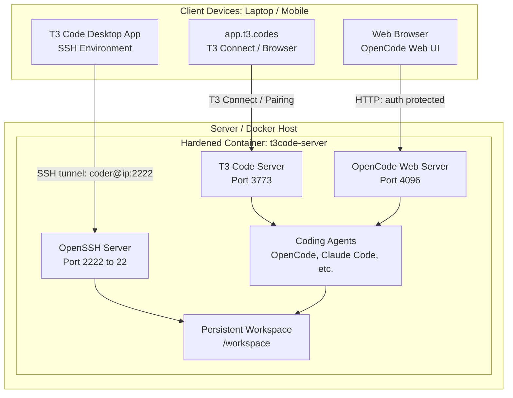

# T3 Code & OpenCode Isolated Docker Server

A production-ready, hardened Docker environment for running [T3 Code](https://github.com/pingdotgg/t3code) and [OpenCode Web](https://github.com/anomalyco/opencode) remotely. This setup enables your autonomous coding agents and background processes to run continuously on a dedicated server (or local machine) while you connect and monitor them from your laptop or mobile phone.

---

## 🏛 Architecture



---

## 🔒 Security Hardening & Isolation

Autonomous coding agents execute shell commands, install packages, and write files. This container is engineered with defense-in-depth isolation:

| Security Feature | Mechanism | Threat Prevented |
| :--- | :--- | :--- |
| **Non-Root Execution** | Runs as user `coder` (UID 1000) | Root compromises & host modifications |
| **No Docker Socket Mount** | `/var/run/docker.sock` is **strictly excluded** | Container breakout to host root |
| **Privilege Escalation Block** | `security_opt: [no-new-privileges:true]` | Exploiting setuid binaries to gain root |
| **Capability Dropping** | `cap_drop: [ALL]`, bounded minimal adds | Kernel exploits, raw network forging |
| **Fork Bomb Protection** | `pids_limit: 500` | Process starvation & system freeze |
| **Resource Caps** | Configurable CPU & RAM limits (`cpus: 4.0`, `memory: 8G`) | Host Out-Of-Memory (OOM) crashes |
| **Root SSH Disabled** | `PermitRootLogin no`, `AllowUsers coder` | Brute-force root SSH attacks |
| **Web Authentication** | `OPENCODE_SERVER_PASSWORD` protected | Unauthorized browser access |

---

## 🚀 Quick Start

### 1. Clone & Configure

Navigate to this directory on your server (or local machine):

```bash
# If on Linux / macOS:
cp .env.example .env

# Edit .env to set your passwords and resource caps
nano .env
```

*(On Windows PowerShell: `Copy-Item .env.example .env`)*

### 2. Start the Server

```bash
# Using the helper script:
./start.sh      # Linux / macOS
.\start.ps1     # Windows PowerShell

# Or directly with Docker Compose:
docker compose up -d --build
```

### 3. Deploying on Dokploy PaaS
If you are deploying on **Dokploy**, use the dedicated [`docker-compose.dokploy.yml`](./docker-compose.dokploy.yml) file. It includes:
- **Named Docker Volumes** to prevent Dokploy's git checkouts from overwriting your code or database.
- **Traefik Network Integration** (`dokploy-network`) for free automatic Let's Encrypt HTTPS.
- Full step-by-step instructions are available in [**DOKPLOY.md**](./DOKPLOY.md).

---

## 🌐 Connecting Remotely

### Option A: T3 Code Desktop App via SSH (Recommended for Laptops)

The T3 Code desktop application natively supports remote environments via SSH:

1. Open **T3 Code** on your laptop.
2. Go to **Settings** (`Cmd/Ctrl + ,`) → **Connections**.
3. Under **Environments**, click **Add environment** → select **SSH**.
4. Configure connection:
   - **Host:** `<your-server-ip-or-domain>` (or `localhost` if running locally)
   - **User:** `coder`
   - **Port:** `2222` (or the `SSH_PORT` in your `.env`)
   - **Authentication:** SSH Key or Password (from `CODER_PASSWORD` in `.env`)
5. Click **Connect**. T3 Code will open a tunnel, verify the environment (Node.js and build tools are pre-configured), and allow you to orchestrate agents directly inside `/workspace`.

---

### Option B: Remote Web & Mobile via https://app.t3.codes/ (T3 Connect)

To link this container to your cloud T3 account without opening router ports:

1. Run the connect script:
   ```bash
   ./connect-t3.sh      # Linux / macOS
   .\connect-t3.ps1     # Windows PowerShell
   ```
2. The terminal will display an authorization link. Open this URL in your browser and sign into your T3 account.
3. Open [app.t3.codes](https://app.t3.codes) or the T3 Code mobile app on iOS/Android. Your server environment will now appear as an available workspace!

---

### Option C: Direct Pairing (LAN / VPN / Public IP)

If your device can directly reach port `3773`:

1. Generate a pairing link and QR code:
   ```bash
   ./pair-t3.sh         # Linux / macOS
   .\pair-t3.ps1        # Windows PowerShell
   ```
2. Scan the generated QR code with your mobile phone app or paste the pairing URL into **Settings → Connections → Add environment** in your browser.

---

### Option D: OpenCode Web UI (Browser Access)

OpenCode includes a standalone web interface:

1. Open your browser and navigate to:
   ```
   http://<your-server-ip>:4096
   ```
2. Enter the password configured in `OPENCODE_SERVER_PASSWORD` (in `.env`).
3. You can now configure your AI providers (Anthropic Claude, OpenAI, Gemini, Ollama, DeepSeek, etc.), browse `/workspace`, and execute interactive coding tasks directly in the browser!

---

## 🛠 Management & Operations

### Checking Service & Resource Status

```bash
./status.sh     # Linux / macOS
.\status.ps1    # Windows PowerShell
```

Or run commands directly:

```bash
# Check running supervisor processes (sshd, t3code, opencode)
docker compose exec t3code-server supervisorctl status

# View live logs for T3 Code
docker compose exec t3code-server tail -f /var/log/supervisor/t3code.out.log

# View live logs for OpenCode Web
docker compose exec t3code-server tail -f /var/log/supervisor/opencode.out.log

# Restart a specific service inside the container
docker compose exec t3code-server supervisorctl restart t3code
docker compose exec t3code-server supervisorctl restart opencode
```

### Entering the Container Shell

```bash
# As the unprivileged 'coder' user:
docker compose exec -it -u coder t3code-server bash

# For administrative tasks (from host only):
docker compose exec -it -u root t3code-server bash
```

---

## 📁 Persistence & Workflow Continuity

To ensure that your work, git repositories, active T3 Code agent threads, and OpenCode workflows **never get lost across deployments, image rebuilds, or server reboots**, data is bound directly to host directories:

```
t3code-docker/
├── workspace/             <-- Mounted to /workspace inside container
│   └── (Your git repos, worktrees, and code files)
├── data/
│   ├── coder_home/        <-- Mounted to /home/coder inside container
│   │   ├── .t3/           <-- T3 Code SQLite DB (state.sqlite), userdata, auth tokens
│   │   ├── .config/       <-- OpenCode configurations, provider models, preferences
│   │   ├── .ssh/          <-- Authorized keys and known hosts
│   │   └── .bashrc        <-- Shell environment and persistent variables
│   └── ssh_host_keys/     <-- Persists server SSH host keys
└── backups/               <-- Timestamped archives created by backup scripts
```

### What Persists Across Container Updates?
1. **Workspace Files & Repositories**: All git clones, branches, edits, and worktrees created by agents in `./workspace` reside directly on the host disk.
2. **T3 Code Threads & Workflows**: T3 Code's internal SQLite database (`state.sqlite`), thread history, pull request reviews, and environment pairings are preserved in `./data/coder_home/.t3`.
3. **OpenCode Configuration & Sessions**: All saved API keys, model provider settings, and interactive task histories are preserved in `./data/coder_home/.config/opencode`.
4. **Git Safe Ownership**: The container automatically applies `git config --global --add safe.directory '*'` on startup, preventing `detected dubious ownership` errors when accessing host repos.

### 💾 Creating Instant Backups

Before performing server maintenance or migrating to a different host:

```bash
# On Linux / macOS:
./backup.sh

# On Windows PowerShell:
.\backup.ps1
```

This creates a self-contained archive in `./backups/` containing your entire workspace, T3 database, and configuration.

### 🔄 Restoring a Backup

```bash
# On Linux / macOS:
./restore.sh backups/t3code_backup_YYYYMMDD_HHMMSS.tar.gz

# On Windows PowerShell:
.\restore.ps1 -BackupFile .\backups\t3code_backup_YYYYMMDD_HHMMSS.zip
```

---

## ⚙ Configuration Reference (`.env`)

| Variable | Default | Description |
| :--- | :--- | :--- |
| `SSH_PORT` | `2222` | Host port for SSH connections |
| `T3_PORT` | `3773` | Host port for T3 Code server |
| `OPENCODE_PORT` | `4096` | Host port for OpenCode Web UI |
| `CODER_PASSWORD` | *required* | Password for user `coder` (SSH access) |
| `OPENCODE_SERVER_PASSWORD` | *required* | Web password for OpenCode browser UI |
| `SSH_PUBLIC_KEY` | *optional* | Public SSH key to automatically append to authorized_keys |
| `ENABLE_SUDO` | `false` | Enable sudo for `coder` (keep `false` for maximum security) |
| `CPU_LIMIT` | `4.0` | Maximum CPU cores allowed |
| `MEMORY_LIMIT` | `8G` | Maximum RAM allowed before throttled |
| `PIDS_LIMIT` | `500` | Process limit to prevent fork bombs |
| `ANTHROPIC_API_KEY` | *optional* | Pre-configured Claude API key |
| `OPENAI_API_KEY` | *optional* | Pre-configured OpenAI API key |
| `GEMINI_API_KEY` | *optional* | Pre-configured Google Gemini API key |
